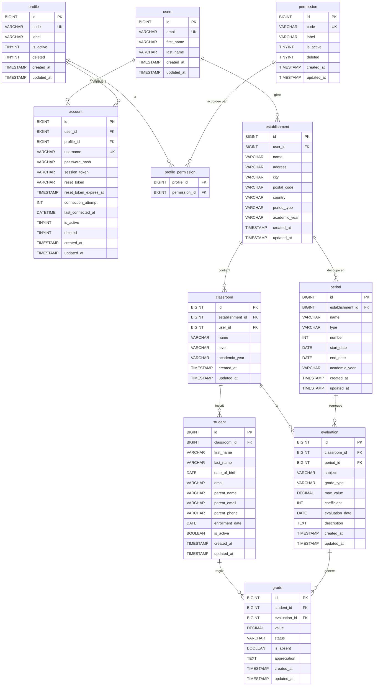

# Modélisation BDD — Klaso

Schéma cible complet, cohérent avec les migrations existantes (V1.0.0→V1.0.3) et les besoins exprimés.

---

## Diagramme Entité-Relation



---

## Hiérarchie des données

```
users / account (IAM)
└── establishment
    ├── period (TRIMESTRE | SEMESTRE)
    └── classroom
        ├── student
        └── evaluation (liée à une period)
            └── grade (une note par élève)
```

---

## Décisions de conception

### ✅ Séparation `users` / `account`
- `users` = identité civile (nom, email)
- `account` = authentification (password_hash, session, reset_token, profil)
- Le `reset_token` est déplacé de `users` vers `account` (cohérence IAM)

### ✅ `classroom` conserve `subject`
- Une classe correspond à un groupe d'élèves pour **une matière précise** enseignée par le professeur.
- `classroom` garde : `name`, `level`, `subject`, `academic_year`

### ✅ `period` liée à `establishment`
- Le choix trimestre/semestre est défini au niveau de l'établissement (`period_type`)
- Chaque période possède un `number` (1, 2, 3...), un `type`, des dates et une `academic_year`

### ✅ `evaluation` = source unique de vérité pour une épreuve
- Porte : `grade_type`, `max_value`, `coefficient`, `description`, `evaluation_date` (et utilise le `subject` de la `classroom`)
- Liée à `classroom` ET à `period`

### ✅ `grade` épurée
- Suppression des colonnes redondantes : `grade_type`, `subject`, `max_value`, `coefficient`, `description` (issues de V1.0.0)
- Garde : `value`, `status`, `is_absent`, `appreciation`
- Liée à `student` + `evaluation` uniquement (suppression du lien direct `classroom_id`)

---

## Calculs applicatifs (niveau service Java)

| Calcul | Données sources |
|---|---|
| Moyenne élève / période | `grade.value` filtrées par `evaluation.period_id` = X et `grade.student_id` = Y, pondérées par `evaluation.coefficient` |
| Moyenne annuelle élève | Moyenne de toutes ses moyennes par période |
| Moyenne classe / évaluation | Moyenne de tous les `grade.value` pour un `evaluation_id` donné |
| Moyenne classe / période | Agrégat par `evaluation.period_id` et `classroom_id` |

---

## Ce qui change vs migrations actuelles

| Actuel | Cible | Action |
|---|---|---|
| `users.password` | Supprimé | À retirer (auth portée par `account`) |
| `users.reset_token` | Déplacé dans `account` | Migrer + supprimer de `users` |
| `evaluation.subject` | Supprimé | Redondant avec `classroom.subject` (car une classe = une matière) |
| `grade.grade_type`, `.subject`, `.max_value`, `.coefficient`, `.description` | Supprimés | Redondants avec `evaluation` |
| `grade.classroom_id` | Supprimé | Redondant (`grade → evaluation → classroom`) |
| `evaluation` sans `period_id` | Ajout de `period_id FK` | Lien manquant |
| `evaluation` sans FK `classroom_id` | Ajout contrainte FK | Bug actuel |
| `period` inexistante | Création | Entité cœur |
| `establishment` sans `period_type` | Ajout colonne | Config trimestre/semestre |

